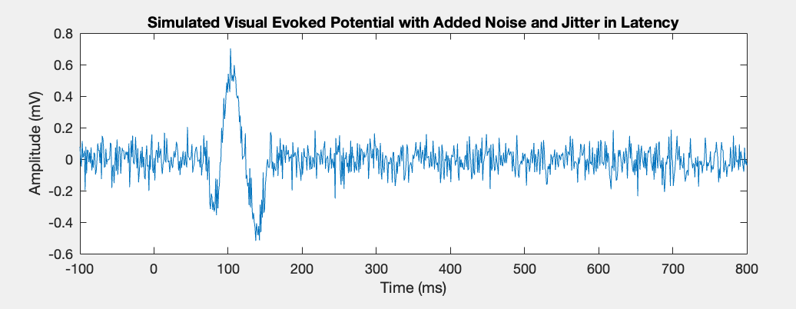
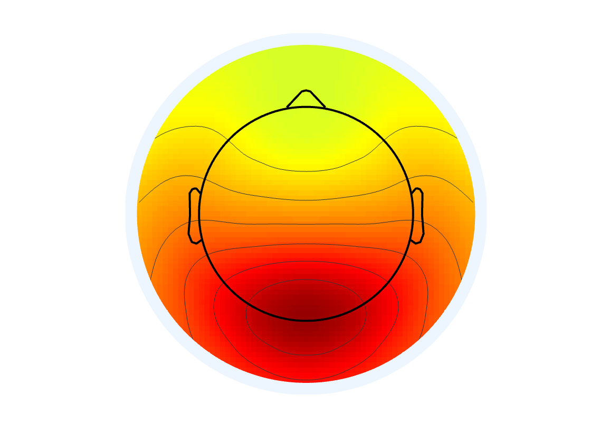
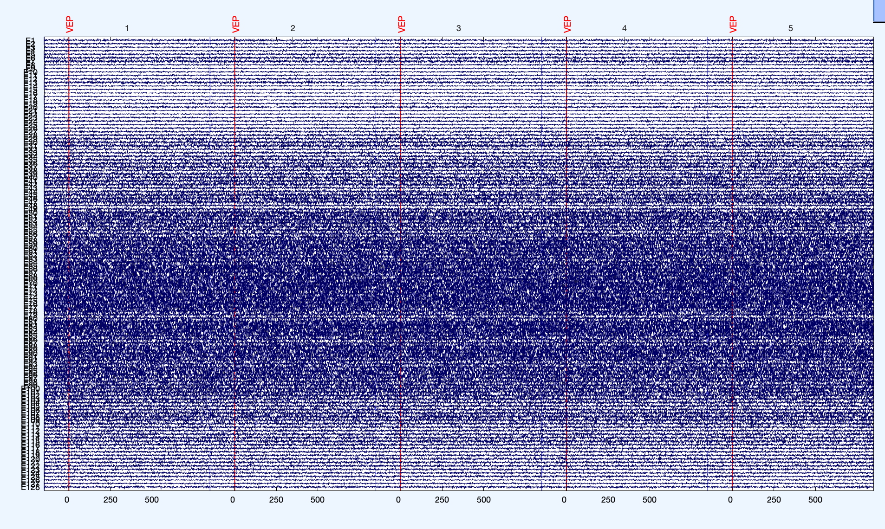

# Simulated Visual Evoked Potential
This is a function that generates simulated electroencephalography (EEG) data for a visual evoked potential (VEP) experiment. It takes various parameters as inputs and returns a structure containing the simulated EEG data, the average VEP waveform, the time values corresponding to each sample in the EEG data, and information about the channels in the EEG data. It can be used to test algorithms that analyze VEP data or to train machine learning models. The function uses the input arguments to control the characteristics of the generated data, such as the latencies and amplitudes of the VEP components, the number of trials and channels, and the sample rate and trial length.


## TODO
- add realistic artifacts
- create custom datasets based on a progressive variable (i.e. increasing amplitude)

Getting Started
To use this code, download or clone the repository and run the simulated_VEP.m file in Matlab.
EEGLAB is a prerequisite to build the EEG SET file

Prerequisites
This code requires Matlab to run.

Focus of VEP is "Oz" equivelent on EGI 128 net (with a gaussian distribution of the peak)


Output is a standard EEG SET file


Usage:
see eeg_htpEegStimulateVepTest.m

```
% generate simulated EEG data with default arguments
EEG = eeg_htpEegVepGenerator();

% define input arguments
latency1 = 75;
latency2 = 100;
latency3 = 135;
amplitude1 = -0.5;
amplitude2 = 1;
amplitude3 = -0.75;
baseline = 0;
baseline_duration = 150;
numTrials = 150;
numChannels = 128;
sampleRate = 1000;
trialLength = 1000;
noiseAmplitude = 10;
jitterRange = 10;
peak_channel = 75;

% generate simulated EEG data
EEG = eeg_htpEegVepGenerator(...
    'latency1', latency1, ...
    'latency2', latency2, ...
    'latency3', latency3, ...
    'amplitude1', amplitude1, ...
    'amplitude2', amplitude2, ...
    'amplitude3', amplitude3, ...
    'baseline', baseline, ...
    'baseline_duration', baseline_duration, ...
    'numTrials', numTrials, ...
    'numChannels', numChannels, ...
    'sampleRate', sampleRate, ...
    'trialLength', trialLength, ...
    'noiseAmplitude', noiseAmplitude, ...
    'jitterRange', jitterRange, ...
    'peak_channel', peak_channel);


% increase the number of trials
EEG = eeg_htpEegVepGenerator(...
    'latency1', latency1, ...
    'latency2', latency2, ...
    'latency3', latency3, ...
    'amplitude1', amplitude1, ...
    'amplitude2', amplitude2, ...
    'amplitude3', amplitude3, ...
    'baseline', baseline, ...
    'baseline_duration', baseline_duration, ...
    'numTrials', 200, ... % increase the number of trials
    'numChannels', numChannels, ...
    'sampleRate', sampleRate, ...
    'trialLength', trialLength, ...
    'noiseAmplitude', noiseAmplitude, ...
    'jitterRange', jitterRange, ...
    'peak_channel', peak_channel);
```


Built With
Matlab - The programming language used
Authors
E. Pedapati - Initial work - GitHub User
See also the list of contributors who participated in this project.

License
This project is licensed under the MIT License - see the LICENSE.md file for details

